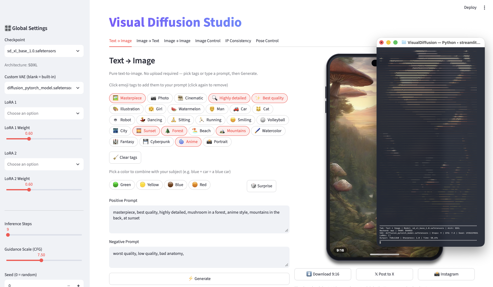
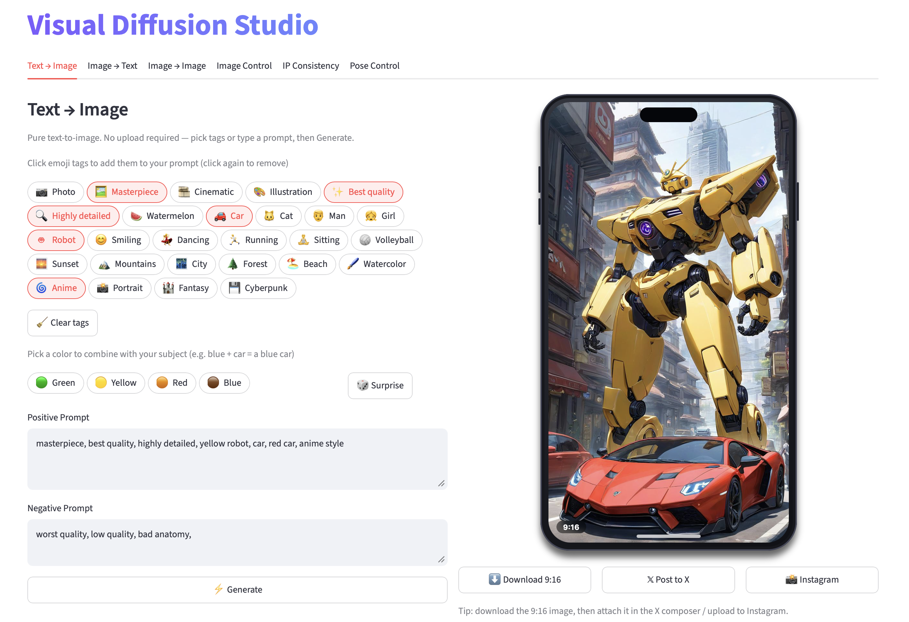
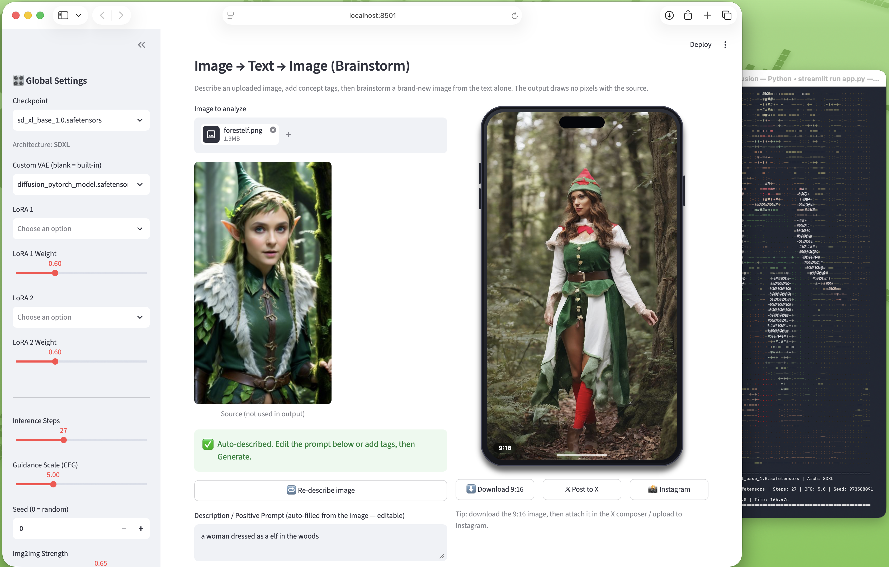
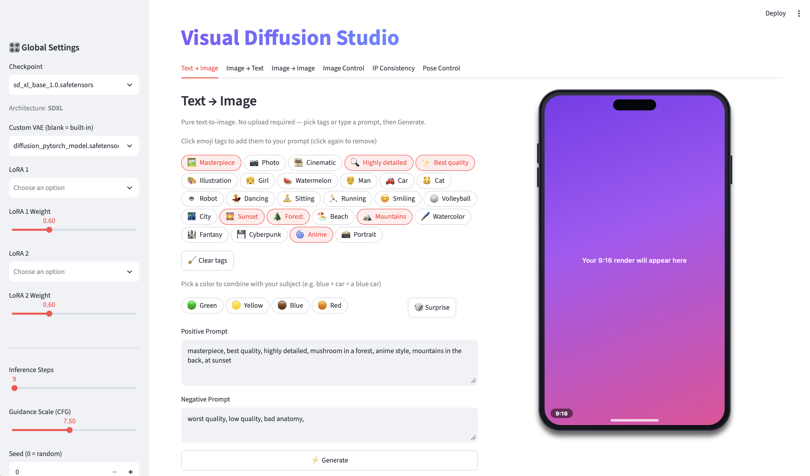
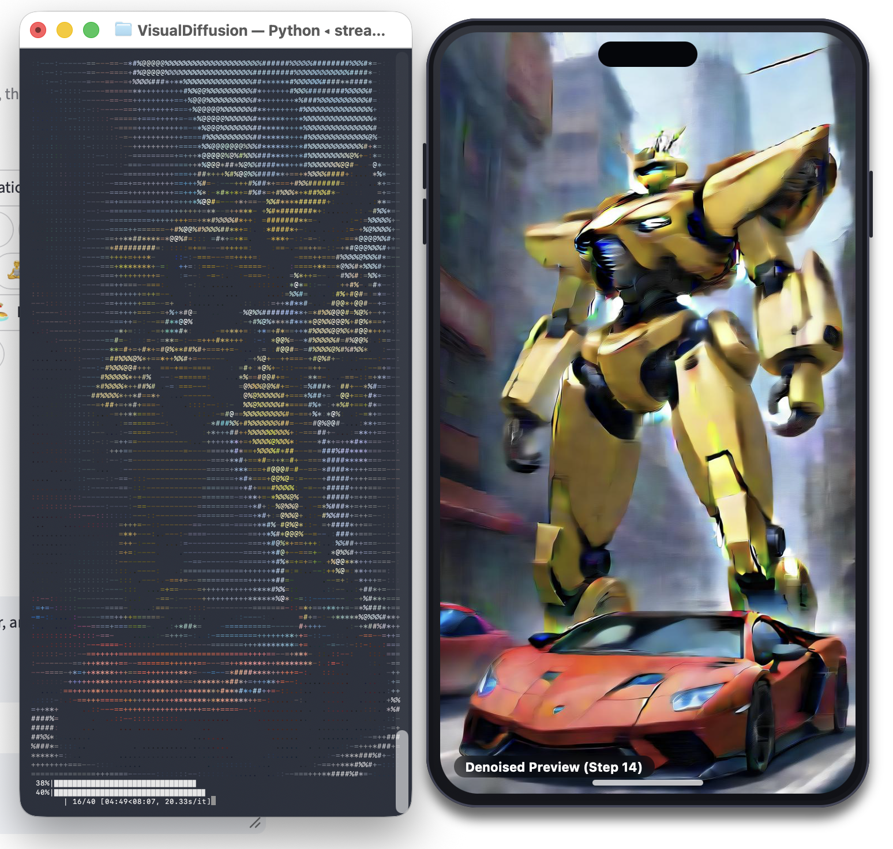
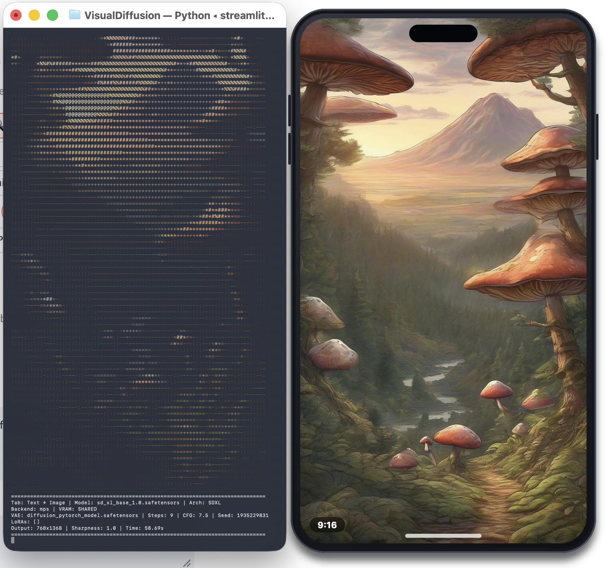
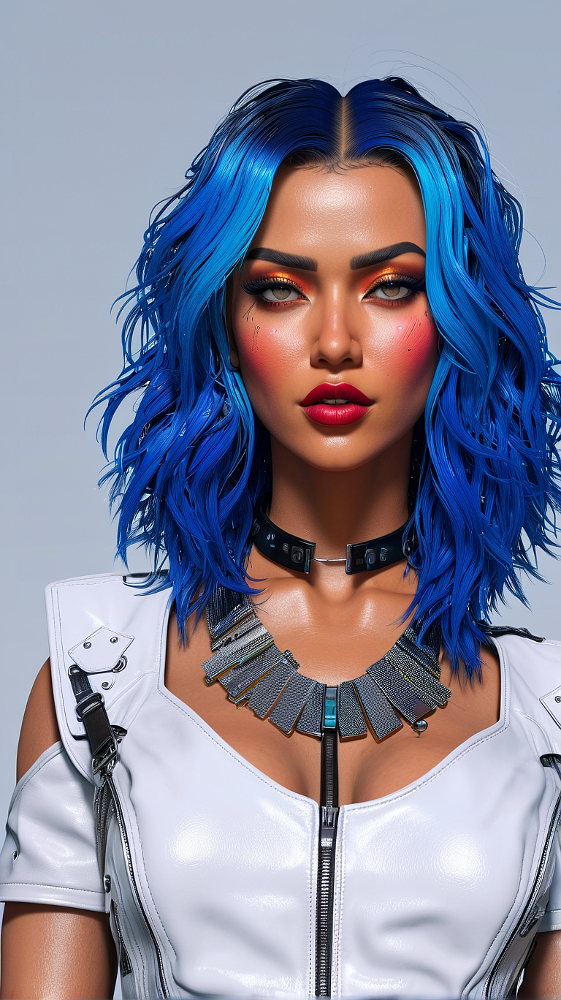

# VisualDiffusion

A Streamlit-based image generation studio with a mobile-first 9:16 share workflow.

No models, weights, or checkpoints are bundled. You provide the assets in `models/`; the
app runs entirely under your local control.

## Demo

### Key Features

| Feature | Screenshot |
|---------|------------|
| Text -> Image |  |
| Brainstorming |  |
| Prompting with emojis |  |
| Terminal ASCII previews |  |
| Terminal summary overview |  |

### Sample Gallery

| :---: | :---: | :---: |
|  |  |  |
|  |  |  |
|  |  |  |

## Essential Setup

1. **Clone** the repo
2. **Create the venv** — `python3.12 -m venv visual && source visual/bin/activate`
3. **Install dependencies** — `pip install -r requirements.txt`
4. **Run setup** — `python setup.py` (creates directories, downloads curated models, configures safety)
5. **Launch** — `streamlit run app.py`

For full step-by-step setup, model placement, and operator configuration, see **[SETUP.md](SETUP.md)**.

## Requirements

- Python 3.12
- pip
- A machine with a CUDA, MPS (Apple Silicon), or CPU GPU backend

## Project Structure

- **`app.py`** — Main Streamlit application and generation tabs
- **`core/`** — Engine, config, safety, and asset discovery
- **`ui/`** — Share card and phone-frame rendering
- **`config/app_config.example.json`** — Configuration template
- **`config/app_config.json`** — Live operator config (gitignored, created by `setup.py`)
- **`setup.py`** — First-time setup, model downloads, and safety prompts
- **`requirements.txt`** — Python dependencies

## Configuration

`config/app_config.json` is the live config file. It is **not** committed to git; the
template `config/app_config.example.json` documents every available option and is versioned.

Key sections:

- **`common`** — Checkpoint, VAE, LoRAs, steps, CFG scale, seed, output size, previews
- **`tabs`** — Per-tab default prompts, negative prompts, and tab-specific overrides
- **Safety** — `safety_checker_black_out_nsfw`, `text_classifier_enabled`, `early_safety_*`

On first run, or any time you run `python setup.py --config`, the app will walk you
through every parameter to create or update the config from scratch.

## Safety & Operator Responsibility

All content moderation lives in `safety.py` and is enforced in four layers:

1. **Prompt term gate** — operator-maintained blocklist in `safety.py`; prompts in non-Latin scripts are refused
2. **Text classifier** — optional prompt-side NSFW check before generation starts
3. **Image censor** — CompVis StableDiffusionSafetyChecker replaces flagged output with a black image
4. **Early safety gate** — single CLIP check at a configurable denoise step to abort unsafe content early

Safety settings require an intentional operator decision to opt out. They are configured
via `python setup.py --config` and are not exposed in the Streamlit sidebar.

See `safety.py` and `models/safety_checker/README.md` for details on each layer.

## Model Placement

- Checkpoints → `models/checkpoints/`
- VAEs → `models/vae/`
- LoRAs → `models/lora/`
- ControlNets → `models/controlnet/`
- IP-Adapters → `models/ip-adapter/`
- Safety checkers → `models/safety_checker/`

Missing assets are detected at runtime; the app will prompt you to download them on first use.

## ⚖️ Ethical Use & Safety Disclaimer

This project is a localized user interface tool designed for generative text-to-image workflows.

* **No Data Bundling:** This software is an empty engine. It does not bundle, host, or distribute AI models, safety weights, or fine-tuned checkpoints. Users are entirely responsible for the models and services they choose to connect to this client.
* **Safe-by-Default:** By default, this application executes with its content-filter hooks enabled — including the output-side NSFW image guard and the non-Latin / CJK prompt refusal. The operator-supplied blocklist starts empty; disabling or weakening any of these mechanics requires manual developer configuration and places all generated-output compliance liability solely onto the operator.
* **Prohibited Content:** The developer strictly prohibits the use of this interface for generating illegal content, including Child Sexual Abuse Material (CSAM), non-consensual sexual imagery (Deepfakes), or material that violates local regulations. Note that face-swap / deepfake generation paths are present in the code but are disabled by default and gated by the prompt-side guard.

The developers provide this software as-is and are not liable for any output produced by it. The operator is solely responsible for complying with the laws and regulations that apply to them.

## 🛡️ Safety / Content Filtering

All moderation lives in the single importable module **`safety.py`**, which the
generation scripts call at two points: before generation (prompt gate) and
after each preview / final image (output guard). It is organized into three
ordered layers:

1. **`BLOCKED_LIST` (prompt term gate).** An operator-maintained list of terms
   to refuse (e.g. a competitor's name, a specific individual, or any term the
   operator chooses to exclude). Starts **empty** — you decide its contents.
   Prompts written in non-Latin scripts (CJK / Japanese / Korean) are refused
   regardless of the list, as this tool is English / Latin-prompt only.
2. **Text Classifier Trigger Abort (enabled by default; operator can opt-out).** When enabled, a text classifier
   you have selected aborts generation if it flags the positive prompt. The
   project does **not** bundle or recommend any specific classifier; you choose
   one that aligns with the laws and regulations applicable to you and set
   `TEXT_CLASSIFIER_MODEL` accordingly. You can disable this during setup or
   in `config/app_config.json`.
3. **Preview / Final Image Guard (CompVis safety checker, via diffusers).** After
   an image is generated (and for each decoded preview latent), it is inspected
   by the `CompVis/stable-diffusion-safety-checker` through diffusers' own
   `StableDiffusionSafetyChecker` class. Any flagged image is replaced with a
   black image, and generation aborts early if a preview is flagged. This acts
   as a guard against likely and potential NSFW generated outputs. See
   `models/safety_checker/README.md` for the model, its source, its scope
   and limits.

**Operator responsibility.** These are technical guards, not a substitute for
legal compliance or human judgment. Disabling or weakening any layer requires
manual configuration and places all generated-output compliance liability onto
the operator. The operator remains responsible for every prompt submitted and
every image produced.
